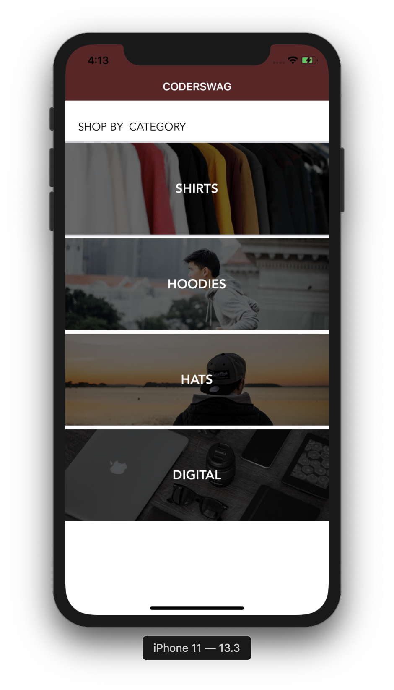

# coder-swag
Mobile shop

- tableview (CategoryCell.swift, Category.swift)
- service & singleton & static data (DataService.swift)
- protocols and delegates (CategoriesVC.swift - UITableViewDataSource, UITableViewDelegate)
- segue (CategoriesVC.swift)
- collectionview (ProductCell.swift, Product.swift, ProductsVC.swift)

 
